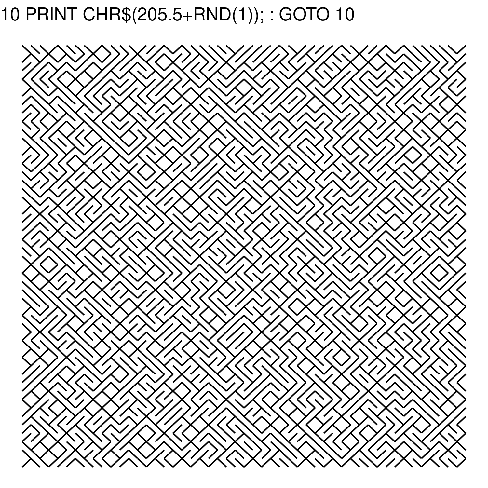
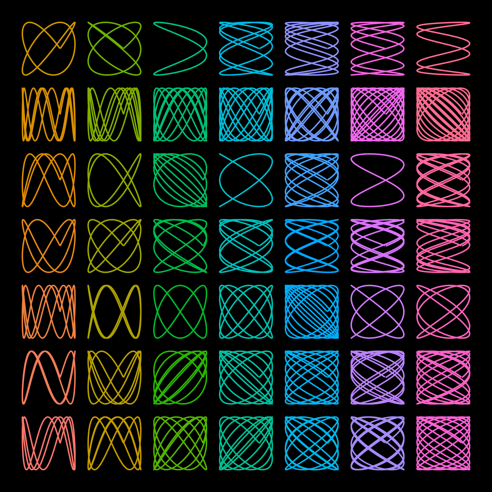
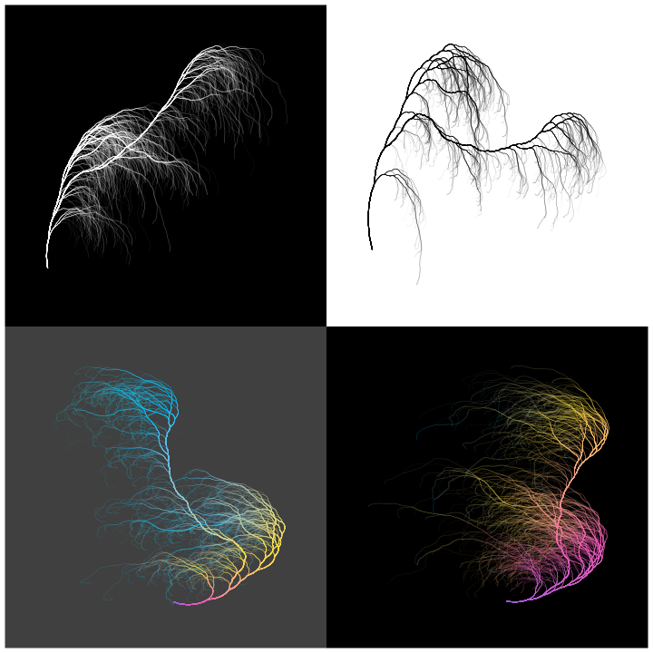
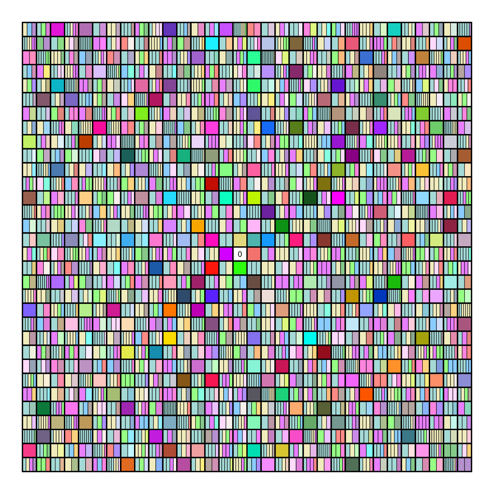
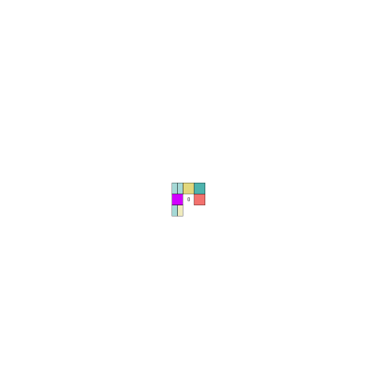

<!-- README.md is generated from README.Rmd. Please edit that file -->

```{r, include = FALSE}
knitr::opts_chunk$set(
  collapse = TRUE,
  comment = "#>"
)
```

# genuary

More information on [genuary](https://genuary2021.github.io/).

## Prompt 05 - code golf

```{r golf, eval=FALSE}
library(tidyverse)
df <- expand_grid(x=1:50,y=1:50)
df$type <- sample(c("l","r"),nrow(df),replace=TRUE)
mutate(df,xend=ifelse(type=="r",x+1,x),yend=y+1,x=ifelse(type=="l",x+1,x)) %>% 
  ggplot(aes(x,y,xend=xend,yend=yend))+geom_segment()+theme_void()+
  ggtitle("10 PRINT CHR$(205.5+RND(1)); : GOTO 10")
```



## Prompt 08 - curves

[Lissajou curves](https://en.wikipedia.org/wiki/Lissajous_curve)


Final frame  




## Prompt 10 - tree

trees created with [Collatz sequences](https://en.wikipedia.org/wiki/Collatz_conjecture)



animated


## Prompt 12 - api


## Prompt 13 - no repeat

Ulam Spiral with prime factor decomposition and unique colours for prime numbers (1-1023)



animated 




